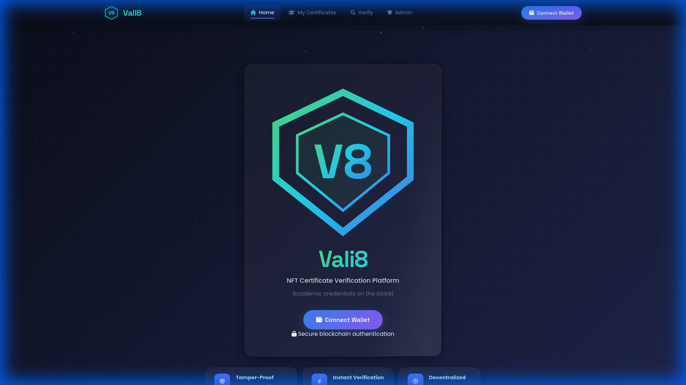
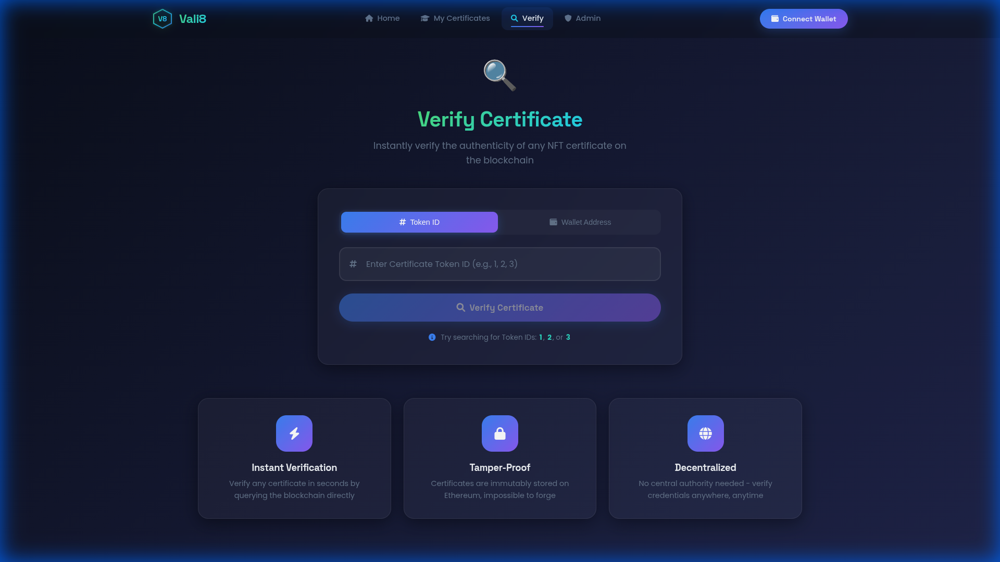
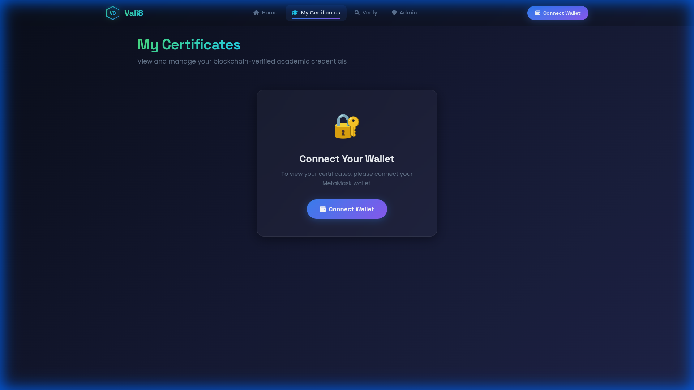
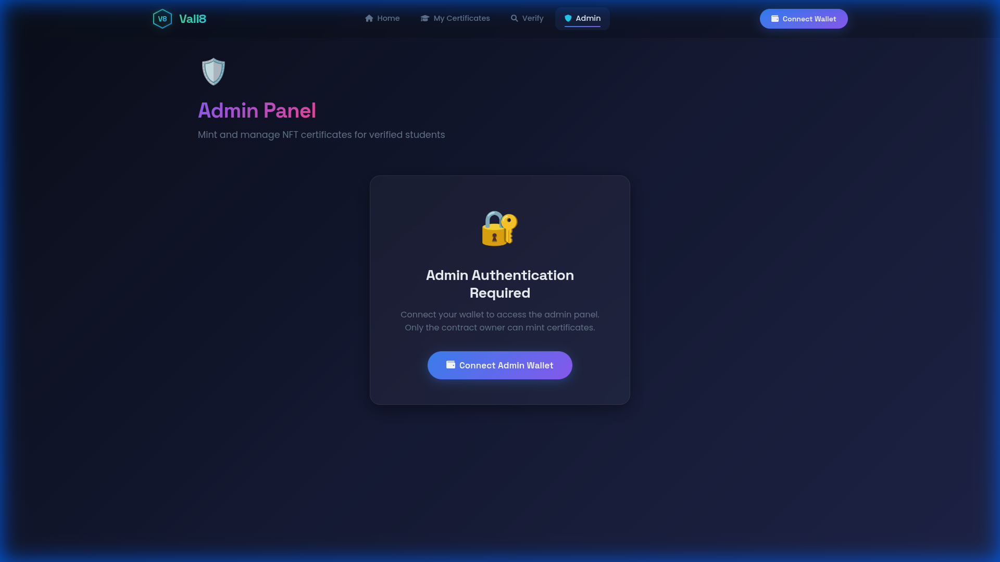

# 🛡️ Vali8 - Blockchain Credential Verification

> **Next-Generation NFT Certificate Verification Platform**

Vali8 is a cutting-edge decentralized application (dApp) designed to revolutionize academic credential verification. Built on Ethereum, it provides a tamper-proof, instant, and transparent way to issue and verify certificates as NFTs.

Experience the future of digital credentials with a premium "Cyber-Finance" interface featuring holographic effects, particle networks, and seamless blockchain integration.



## ✨ Key Features

### 🌐 Immersive Experience
- **Particle Network Canvas**: Interactive background visualizing decentralized connections.
- **3D Tilt Cards**: Hero elements respond to mouse movement for depth perception.
- **Typing Animation**: Dynamic text presentation that engages users immediately.

### ⚡ Powerful Functionality
- **Instant Verification**: Query the blockchain in milliseconds to validate any certificate.
- **Secure Dashboard**: Connect your MetaMask wallet to view your personal certificate portfolio.
- **Admin Console**: dedicated portal for institutions to mint new credentials with a 3-step wizard.

### 🎨 Premium Design System
- **Glassmorphism**: Modern, frosted-glass UI with sophisticated blur effects.
- **Holographic Shimmer**: Interactive hover states that feel alive.
- **Neon Glows**: vibrant accent colors for a futuristic aesthetic.

## 📸 App Gallery

| **Verification Portal** | **User Dashboard** |
|:---:|:---:|
|  |  |
| **Clean, toggle-based search interface** | **Personalized view of your NFT credentials** |

| **Admin Console** | **Minting Wizard** |
|:---:|:---:|
|  | *Streamlined 3-step minting process* |
| **Secure access for authorized issuers** | **Drag & drop upload with preview** |

## 🚀 Tech Stack

- **Framework**: [Angular 17+](https://angular.io/) (Standalone Components)
- **Blockchain**: [Ethers.js](https://docs.ethers.org/) for Ethereum interaction
- **Styling**: Native CSS Variables, Flexbox/Grid, Custom Keyframe Animations
- **Fonts**: Space Grotesk (Headings), Inter & JetBrains Mono (Body/Code)

## 🛠️ Getting Started

Follow these steps to set up the project locally:

1.  **Clone the repository**
    ```bash
    git clone https://github.com/yourusername/vali8.git
    cd vali8
    ```

2.  **Install dependencies**
    ```bash
    npm install
    ```

3.  **Start the development server**
    ```bash
    ng serve
    ```

4.  **Open your browser**
    Navigate to `http://localhost:4200/` to see the application running.

## 🤝 Contributing

Contributions are welcome! Please run `ng test` to ensure all tests pass before submitting a pull request.

---

<p align="center">
  Built with ❤️ by Vali8 Team
</p>
